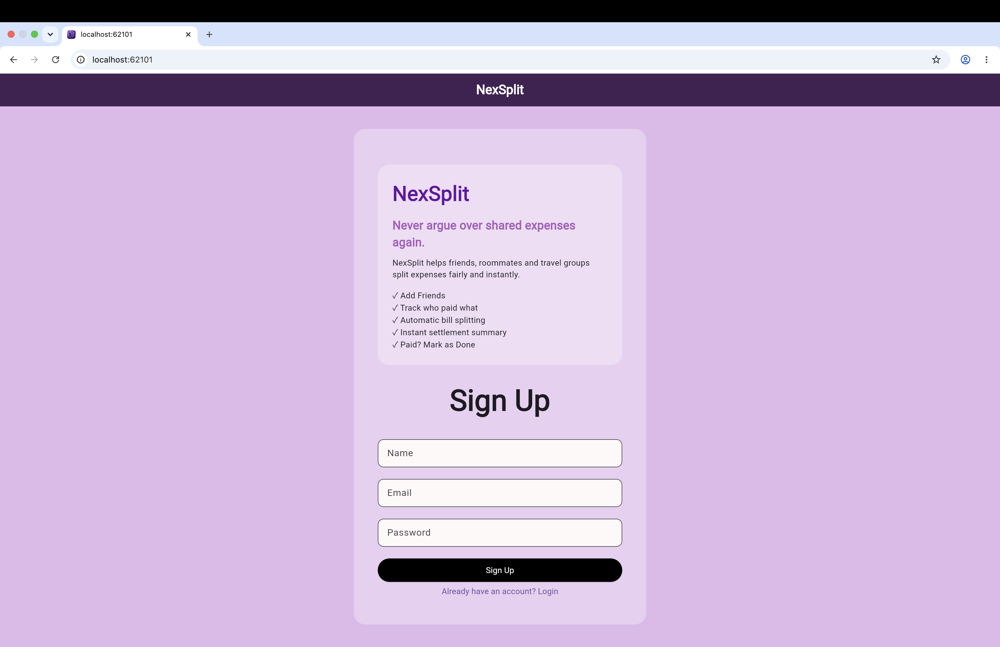
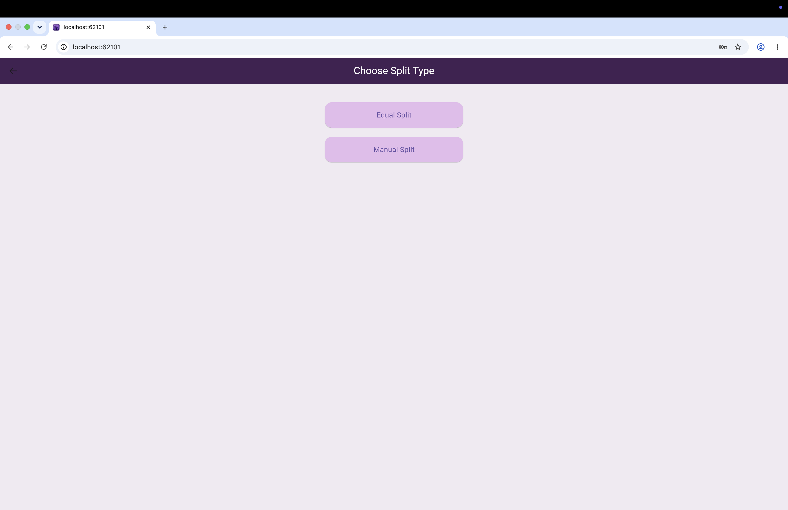
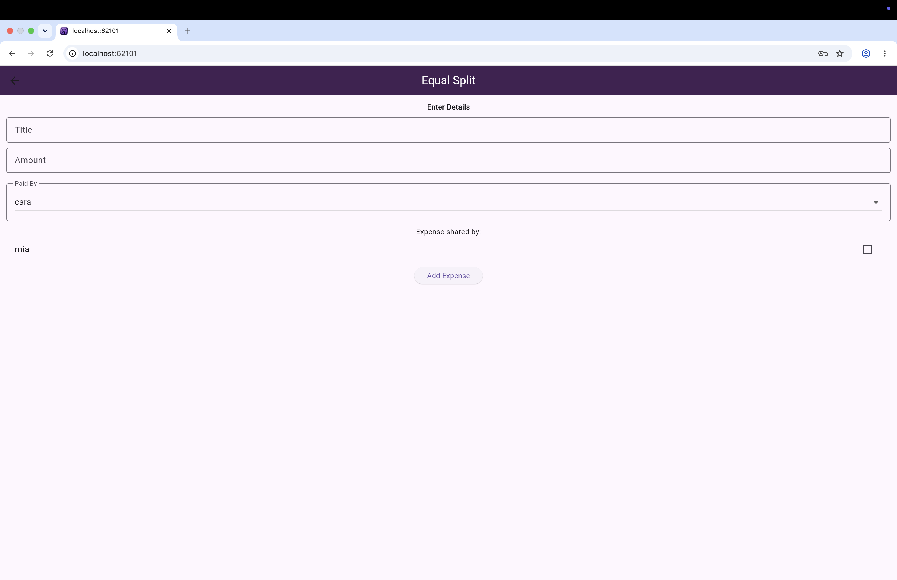
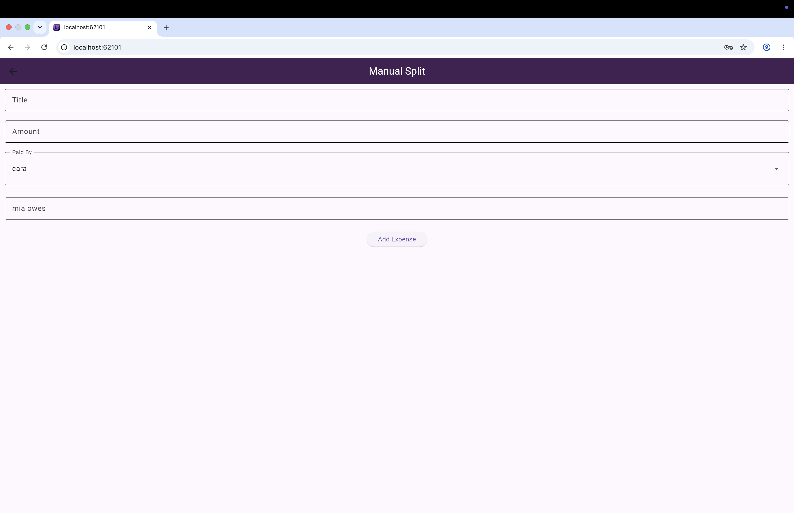
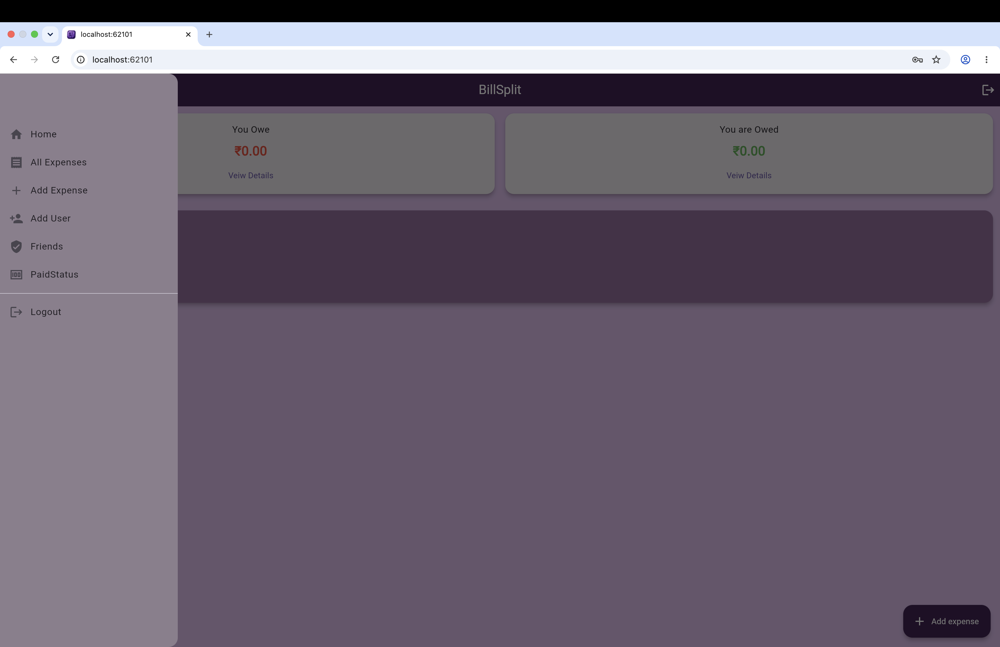

# NexSplit

NexSplit is a Flutter and Firebase-powered expense splitting application that helps friends, roommates, and groups manage shared expenses and settlements.

## Features

- User Authentication
- Expense Tracking
- Shared Expense Management
- Settlement Tracking
- Cloud Firestore Integration
- Responsive Web Interface
- Firebase Hosting Deployment

## Tech Stack

- Flutter
- Dart
- Firebase Authentication
- Cloud Firestore
- Firebase Hosting

## Live Demo

https://billsplit-fff70.web.app

## Why NexSplit?

Managing group expenses can be frustrating. NexSplit simplifies the process by allowing users to record shared expenses and keep everyone informed about payments and settlements.

## Application Preview

## Author

Hail Seejo
